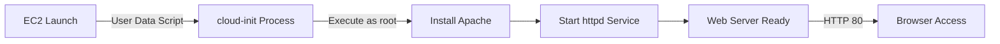

# Q7: EC2 Web Server with User Data

## Lab Overview
- **Difficulty:** Beginner
- **Estimated Time:** 30-35 minutes
- **AWS Services:** EC2, User Data, Apache HTTP Server
- **Region:** us-east-1
- **Cost:** Free Tier (t2.micro 750 hours)

## Prerequisites Check
- [ ] Completed Q1 VPC setup with public subnets
- [ ] Basic understanding of bash scripting
- [ ] AWS CLI configured (optional)

## Learning Objectives
- Write bash user data scripts for EC2 bootstrap
- Automate Apache HTTP Server installation via user data
- Verify cloud-init execution and logs
- Test web server accessibility from internet
- Understand user data execution timing and limitations

## Architecture Overview


## Step-by-Step Console Instructions

### Step 1: Create Web Server Security Group
**Console Navigation:** EC2 → Security Groups → Create security group

**Detailed Steps:**
1. Name: `practice-web-sg-q7`
2. Description: "Web server for user data lab"
3. VPC: `practice-vpc-q1`
4. Inbound rules:
   - Rule 1: HTTP, Port 80, Source: 0.0.0.0/0
   - Rule 2: SSH, Port 22, Source: your IP/32 (for verification)
5. Outbound: default
6. Tags: Name = `practice-web-sg-q7`
7. Create security group

[SCREENSHOT: Web security group created]

### Step 2: Prepare User Data Script
Create a file `userdata.sh` on your local machine:
```bash
#!/bin/bash
# Update system packages
yum update -y

# Install Apache HTTP Server
yum install -y httpd

# Enable httpd to start on reboot
systemctl enable httpd

# Start httpd service
systemctl start httpd

# Create custom index.html
cat > /var/www/html/index.html <<'EOF'
<!DOCTYPE html>
<html>
<head>
    <title>User Data Web Server</title>
    <style>
        body { font-family: Arial, sans-serif; text-align: center; padding: 50px; background: #e8f4f8; }
        h1 { color: #232f3e; }
        p { color: #666; font-size: 16px; }
        .info { background: white; border-radius: 5px; padding: 20px; display: inline-block; }
    </style>
</head>
<body>
    <div class="info">
        <h1>User Data Web Server</h1>
        <p><strong>Instance ID:</strong> EC2_INSTANCE_ID_PLACEHOLDER</p>
        <p><strong>Hostname:</strong> $(hostname -f)</p>
        <p><strong>Launched via:</strong> User Data Script</p>
        <p><strong>Server Time:</strong> $(date)</p>
    </div>
</body>
</html>
EOF

# Log completion
echo "User data script completed at $(date)" >> /var/log/user-data.log
```

[SCREENSHOT: userdata.sh file created locally]

Note: The `#!/bin/bash` shebang is MANDATORY

### Step 3: Launch EC2 Instance
**Console Navigation:** EC2 → Instances → Launch instances

**Detailed Steps:**
1. Name: `practice-ec2-q7`
2. AMI: Amazon Linux 2023 (Free Tier)
3. Instance type: `t2.micro`
4. Key pair: `practice-key-q2`
5. Network settings (Edit):
   - VPC: `practice-vpc-q1`
   - Subnet: `practice-public-1a`
   - Auto-assign public IP: Enable
   - Firewall: `practice-web-sg-q7`
6. Storage: 8 GiB gp3 (default)
7. Advanced details (expand):
   - **User data:** Paste complete user data script (including shebang)
   - Text box should start with `#!/bin/bash`
8. Tags: Name = `practice-ec2-q7`
9. Launch instance

[SCREENSHOT: EC2 launched with user data script]

### Step 4: Wait for Instance Ready
1. EC2 → Instances → wait for status "Running"
2. Wait for Status checks "2/2 checks passed" (2-3 minutes)
3. Note Public IPv4 address (e.g., 54.123.45.67)

[SCREENSHOT: Instance running with 2/2 status checks]

### Step 5: Verify Apache Installation
1. Wait 30 seconds after 2/2 status (allows time for user data)
2. Open browser: `http://<public-ip>`
3. Expected: "User Data Web Server" heading displays
4. Shows instance ID, hostname, current time

[SCREENSHOT: Website loaded in browser]

### Step 6: Verify cloud-init Logs (Optional SSH Verification)
**SSH into instance:** `ssh -i practice-key-q2.pem ec2-user@<public-ip>`

```bash
# Check cloud-init completion
tail -50 /var/log/cloud-init-output.log
# Should show httpd installation and service start

# Verify httpd is running
sudo systemctl status httpd
# Expected: active (running)

# Check httpd processes
ps aux | grep httpd
# Shows multiple httpd processes

# Check HTTP listening
sudo netstat -tlnp | grep :80
# Shows httpd listening on port 80

# Verify index.html exists
cat /var/www/html/index.html
# Shows HTML content

# Check Apache access logs
cat /var/log/httpd/access_log
# Shows GET requests
```

[SCREENSHOT: SSH verification showing httpd running]

## CLI Alternative (Copy-Paste Ready)
```bash
REGION=us-east-1

# Get VPC and subnet
VPC_ID=$(aws ec2 describe-vpcs --filters "Name=tag:Name,Values=practice-vpc-q1" \
  --query 'Vpcs[0].VpcId' --output text --region $REGION)
SUBNET=$(aws ec2 describe-subnets --filters "Name=tag:Name,Values=practice-public-1a" \
  --query 'Subnets[0].SubnetId' --output text --region $REGION)

# Get your public IP
YOUR_IP=$(curl -s https://checkip.amazonaws.com)/32

# Create web security group
WEB_SG=$(aws ec2 create-security-group \
  --group-name practice-web-sg-q7 \
  --description "Web server for user data lab" \
  --vpc-id $VPC_ID \
  --region $REGION \
  --query 'GroupId' --output text)
echo "Web SG: $WEB_SG"

# Allow HTTP
aws ec2 authorize-security-group-ingress \
  --group-id $WEB_SG \
  --protocol tcp \
  --port 80 \
  --cidr 0.0.0.0/0 \
  --region $REGION

# Allow SSH from your IP
aws ec2 authorize-security-group-ingress \
  --group-id $WEB_SG \
  --protocol tcp \
  --port 22 \
  --cidr $YOUR_IP \
  --region $REGION

# Get key pair name
KEY_NAME=practice-key-q2

# Get latest Amazon Linux 2023 AMI
AL2023_AMI=$(aws ssm get-parameter \
  --name /aws/service/ami-amazon-linux-latest/al2023-ami-kernel-default-x86_64 \
  --region $REGION \
  --query 'Parameter.Value' --output text)

# Create user data file
cat > /tmp/userdata-q7.sh <<'EOF'
#!/bin/bash
yum update -y
yum install -y httpd
systemctl enable httpd
systemctl start httpd
cat > /var/www/html/index.html <<'HTMLEOF'
<!DOCTYPE html>
<html>
<head>
    <title>User Data Web Server</title>
    <style>
        body { font-family: Arial, sans-serif; text-align: center; padding: 50px; background: #e8f4f8; }
        h1 { color: #232f3e; }
        p { color: #666; font-size: 16px; }
        .info { background: white; border-radius: 5px; padding: 20px; display: inline-block; }
    </style>
</head>
<body>
    <div class="info">
        <h1>User Data Web Server</h1>
        <p><strong>Instance ID:</strong> $(ec2-metadata --instance-id | cut -d " " -f 2)</p>
        <p><strong>Hostname:</strong> $(hostname -f)</p>
        <p><strong>Launched via:</strong> User Data Script</p>
        <p><strong>Server Time:</strong> $(date)</p>
    </div>
</body>
</html>
HTMLEOF
echo "User data script completed at $(date)" >> /var/log/user-data.log
EOF

# Launch EC2
INSTANCE_ID=$(aws ec2 run-instances \
  --image-id $AL2023_AMI \
  --instance-type t2.micro \
  --key-name $KEY_NAME \
  --security-group-ids $WEB_SG \
  --subnet-id $SUBNET \
  --associate-public-ip-address \
  --user-data file:///tmp/userdata-q7.sh \
  --tag-specifications 'ResourceType=instance,Tags=[{Key=Name,Value=practice-ec2-q7}]' \
  --region $REGION \
  --query 'Instances[0].InstanceId' --output text)
echo "Instance ID: $INSTANCE_ID"

# Wait for instance
echo "Waiting for instance..."
aws ec2 wait instance-running --instance-ids $INSTANCE_ID --region $REGION

echo "Waiting for status checks..."
aws ec2 wait instance-status-ok --instance-ids $INSTANCE_ID --region $REGION

# Get public IP
PUBLIC_IP=$(aws ec2 describe-instances \
  --instance-ids $INSTANCE_ID \
  --region $REGION \
  --query 'Reservations[0].Instances[0].PublicIpAddress' --output text)
echo "Public IP: $PUBLIC_IP"
echo "Access at: http://$PUBLIC_IP"

# Test website
sleep 10
curl -I http://$PUBLIC_IP
```

## Verification Checklist

1. **Instance Status**
   - Console: EC2 → Instances → `practice-ec2-q7`
   - State: Running, Status checks: 2/2 passed
   - Public IPv4: Assigned
   - [SCREENSHOT: Instance details]

2. **Security Group Rules**
   - Console: EC2 → Security Groups → `practice-web-sg-q7`
   - Inbound: HTTP 80 from 0.0.0.0/0, SSH 22 from your IP
   - [SCREENSHOT: SG rules]

3. **Browser HTTP Access**
   - Open `http://<public-ip>` in browser
   - Page displays: "User Data Web Server" heading
   - Shows instance ID, hostname, server time
   - [SCREENSHOT: Website in browser]

4. **curl HTTP Test**
   - `curl -I http://<public-ip>` → HTTP/1.1 200 OK
   - `curl http://<public-ip>` → returns HTML content
   - [SCREENSHOT: curl output]

5. **cloud-init Log Verification (SSH)**
   - SSH to instance: `tail -50 /var/log/cloud-init-output.log`
   - Shows yum update, httpd install, systemctl enable/start
   - No error messages
   - [SCREENSHOT: Cloud-init log showing completion]

6. **Apache Service Running**
   - `sudo systemctl status httpd` → active (running)
   - Shows "enabled" and "active" status
   - [SCREENSHOT: systemctl status output]

7. **Process Verification**
   - `ps aux | grep httpd` → shows multiple httpd processes
   - Root process and worker processes visible
   - [SCREENSHOT: httpd processes]

8. **Port Listening**
   - `sudo netstat -tlnp | grep :80` → httpd listening on 0.0.0.0:80
   - Shows TCP LISTEN state
   - [SCREENSHOT: netstat output]

## Troubleshooting Guide

- **Apache not running after launch**
  - Cause: User data script not executed or had errors; httpd install failed
  - Fix: SSH in and check `/var/log/cloud-init-output.log` for errors; manually run `sudo yum install -y httpd && sudo systemctl start httpd`

- **Missing shebang in user data**
  - Cause: Script must start with `#!/bin/bash` or `#!/bin/sh`
  - Fix: Add shebang as first line; user data without shebang won't execute

- **Connection timeout on port 80**
  - Cause: Security group doesn't allow HTTP; instance doesn't have public IP; httpd not running
  - Fix: Verify SG allows port 80; ensure public IP assigned; check httpd status via SSH

- **User data not executing**
  - Cause: Windows line endings (CRLF); syntax errors in script; cloud-init not available
  - Fix: Use Unix line endings (LF); validate bash syntax; check cloud-init-output.log for errors

- **Wrong instance type or AMI**
  - Cause: Non-Free Tier instance or AMI that doesn't support httpd
  - Fix: Use t2.micro; ensure Amazon Linux 2023, Amazon Linux 2, or similar; avoid Ubuntu (uses apt not yum)

- **index.html not displaying**
  - Cause: File not created; httpd not serving; wrong path
  - Fix: SSH and verify `/var/www/html/index.html` exists; check httpd is listening; verify permissions (644 on file, 755 on directory)

- **Metadata not populating in HTML**
  - Cause: EC2 instance metadata service not available during user data
  - Fix: Use static values or query metadata after instance boot; avoid direct substitution in user data

## Cleanup Instructions

**Console Cleanup:**
1. Terminate EC2: EC2 → Instances → `practice-ec2-q7` → Terminate
2. Delete web SG: EC2 → Security Groups → `practice-web-sg-q7` → Delete

**CLI Cleanup:**
```bash
REGION=us-east-1

# Terminate instance
aws ec2 terminate-instances --instance-ids $INSTANCE_ID --region $REGION

# Delete security group
aws ec2 delete-security-group --group-id $WEB_SG --region $REGION
```

**Verification:** EC2 console shows no instances or "terminated" state

## Mark Mapping (Exam Scoring)

| Task | Marks | Criteria | Your Score |
|------|-------|----------|------------|
| Web SG creation | 3 | Allows HTTP 80 from 0.0.0.0/0, SSH from admin IP | [ ] |
| User data script | 5 | Shebang included, yum update, httpd install, enable/start, custom HTML | [ ] |
| EC2 launch config | 3 | t2.micro, correct subnet, public IP enabled | [ ] |
| Public IP assignment | 2 | IP visible in console | [ ] |
| Apache installation | 3 | Service installed and running; verified via status | [ ] |
| HTTP access | 4 | Website accessible via browser and curl; returns 200 OK | [ ] |
| cloud-init verification | 3 | Log shows successful execution; no errors | [ ] |
| Documentation | 2 | Screenshots of website, logs, service status captured | [ ] |
| **Total** | **25** | | **[ ]** |

## Key Takeaways
- User data executes once at first boot as root user; perfect for bootstrap automation
- Shebang is mandatory; without it, script won't execute
- cloud-init logs are at `/var/log/cloud-init-output.log`; always check for errors
- `systemctl enable` ensures service starts on reboot; `systemctl start` starts immediately
- User data has 15-minute timeout; keep scripts efficient
- Metadata service (EC2 instance ID, etc.) should be queried after boot, not in user data directly
- User data is visible in EC2 instance metadata; don't include secrets (credentials, keys)

## Next Steps
- Combine Q7 with Q5 ALB for automated web tier
- Explore advanced user data patterns (CloudFormation, parameter retrieval)
- Review EC2 user data in 03_ec2/server_lab.md

## Related Resources
- Main practice file: 10_indskills/state_level_practice.md (Q7)
- EC2 service guide: 03_ec2/
- User data documentation: https://docs.aws.amazon.com/AWSEC2/latest/UserGuide/user-data.html
- Apache installation guide: https://httpd.apache.org/
