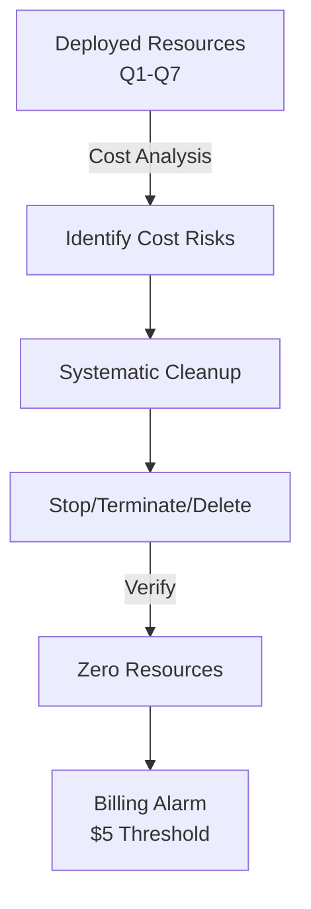

# Q8: Cost Optimization & Cleanup

## Lab Overview
- **Difficulty:** Beginner
- **Estimated Time:** 25-30 minutes
- **AWS Services:** All previous services (EC2, RDS, ElastiCache, ALB, S3, VPC)
- **Region:** us-east-1
- **Cost Focus:** Identifying and eliminating charges

## Prerequisites Check
- [ ] Completed Q1-Q7 (all previous labs)
- [ ] Understanding of AWS billing and Free Tier
- [ ] AWS CLI configured (optional)

## Learning Objectives
- Identify cost-incurring resources in deployed infrastructure
- Execute systematic cleanup procedure in correct dependency order
- Verify resource deletion and zero billing
- Configure billing alarms to prevent future charges
- Understand Free Tier limits and cost implications

## Architecture Overview


## Step-by-Step Console Instructions

### Step 1: Cost Analysis - Identify Billable Resources
**Console Navigation:** Billing → Cost Management → Cost Explorer (optional for visual breakdown)

**Resource Inventory and Cost Analysis:**

| Service | Resource | Free Tier | Cost if Outside | Status |
|---------|----------|-----------|-----------------|--------|
| EC2 | t2.micro instances | 750 hrs/month | $0.0116/hour | Delete after lab |
| RDS | db.t2.micro (Q4) | 750 hrs/month | $0.017/hour | Not needed if Q4 skipped |
| ElastiCache | cache.t2.micro | 750 hrs/month (12mo) | $0.017/hour | Delete after lab |
| ALB | Load Balancer | NOT Free Tier | $16.20/month + $0.008/LCU-hour | **EXPENSIVE** - Delete immediately |
| S3 | Bucket + objects | 5GB storage | $0.023/GB/month | Delete empty buckets |
| Elastic IP | Unassociated | NOT Free Tier | $0.005/hour | Expensive when unassociated |
| NAT Gateway | (if created) | NOT Free Tier | $0.045/hour + data | Delete if not needed |

**Key Finding:** ALB (~$16/month) and unassociated Elastic IPs are the biggest cost risks. Always delete immediately.

[SCREENSHOT: Billing dashboard showing current charges]

### Step 2: EC2 Cleanup
**Console Navigation:** EC2 → Instances

**Detailed Steps:**
1. Check all instances from Q2, Q5, Q7: `practice-ec2-q2`, `practice-web-q5`, `practice-ec2-q7`
2. For each instance:
   - Select instance → Instance State → Terminate
   - Confirm termination
3. Wait for all instances to show "Terminated" state (2-5 minutes)
4. Check Elastic IPs: EC2 → Elastic IPs
5. If any unassociated IPs exist (not assigned to running instance):
   - Select EIP → Release address → Confirm
   - Cost: $0.005/hour per unassociated IP

[SCREENSHOT: All EC2 instances terminated]

**CLI:**
```bash
REGION=us-east-1
aws ec2 terminate-instances \
  --instance-ids i-xxxxx \
  --region $REGION
```

### Step 3: RDS Cleanup
**Console Navigation:** RDS → Databases

**Detailed Steps:**
1. Check for `practice-rds-q4` instance (if Q4 was completed)
2. Select database → Delete
3. Options:
   - Create final snapshot: **No** (skip for practice cleanup)
   - Retain automated backups: **No** (uncheck to delete all backups)
   - Type "delete me" to confirm
4. Delete
5. Wait for database deletion (5-10 minutes)
6. RDS → Snapshots:
   - Delete any manual snapshots `practice-rds-snap-q4`
   - Select → Delete snapshot → Confirm

[SCREENSHOT: RDS database deleted]

**CLI:**
```bash
REGION=us-east-1
aws rds delete-db-instance \
  --db-instance-identifier practice-rds-q4 \
  --skip-final-snapshot \
  --delete-automated-backups \
  --region $REGION
```

### Step 4: ElastiCache Cleanup
**Console Navigation:** ElastiCache → Clusters

**Detailed Steps:**
1. Check for `practice-redis-q6` cluster (if Q6 was completed)
2. Select cluster → Delete → Confirm
3. Option: Create backup: **No**
4. Delete
5. Wait for deletion (5-10 minutes)

[SCREENSHOT: ElastiCache cluster deleted]

**CLI:**
```bash
REGION=us-east-1
aws elasticache delete-cache-cluster \
  --cache-cluster-id practice-redis-q6 \
  --skip-final-snapshot \
  --region $REGION
```

### Step 5: ALB Cleanup (HIGH PRIORITY)
**Console Navigation:** EC2 → Load Balancers

**Detailed Steps:**
1. Check for `practice-alb-q5` (if Q5 was completed)
2. **Important:** Delete ALB before target groups
3. Select ALB → Delete → Confirm
4. Wait for deletion (5-10 minutes; don't rush to next step)
5. EC2 → Target Groups:
   - Delete all `practice-tg-*` target groups
   - Select → Delete → Confirm

[SCREENSHOT: ALB deleted]

**CLI:**
```bash
REGION=us-east-1
# Delete ALB
aws elbv2 delete-load-balancer \
  --load-balancer-arn $ALB_ARN \
  --region $REGION

sleep 30

# Delete target group
aws elbv2 delete-target-group \
  --target-group-arn $TG_ARN \
  --region $REGION
```

### Step 6: S3 Cleanup
**Console Navigation:** S3 → Buckets

**Detailed Steps:**
1. Check for `state-practice-site-q3-*` bucket (if Q3 was completed)
2. Select bucket → Empty (required before deletion)
3. Type "permanently delete" to confirm
4. Wait for empty operation complete
5. Select bucket → Delete → Type bucket name to confirm

[SCREENSHOT: S3 bucket emptied and deleted]

**CLI:**
```bash
REGION=us-east-1
# Empty bucket
aws s3 rm s3://state-practice-site-q3-xxxxx --recursive --region $REGION

# Delete bucket
aws s3api delete-bucket --bucket state-practice-site-q3-xxxxx --region $REGION
```

### Step 7: VPC Network Cleanup
**Console Navigation:** VPC → Your VPCs

**Cleanup Order (dependencies matter):**

**Step 7a: NAT Gateways (if any created)**
1. VPC → NAT Gateways
2. Delete all `practice-nat-*` gateways
3. Also delete associated Elastic IPs
4. Wait for deletion (2-5 minutes)

[SCREENSHOT: NAT Gateway deleted]

**Step 7b: Route Tables**
1. VPC → Route Tables
2. Delete all non-main route tables: `practice-public-rt-q1`, `practice-private-rt`
3. First disassociate all subnets from route table
4. Select route table → Delete

[SCREENSHOT: Route tables deleted]

**Step 7c: Subnets**
1. VPC → Subnets
2. Delete all subnets:
   - Public: `practice-public-1a`, `practice-public-1b`
   - Private: `practice-private-redis-1a`, `practice-private-redis-1b`
3. Select subnet → Delete → Confirm

[SCREENSHOT: Subnets deleted]

**Step 7d: Internet Gateway**
1. VPC → Internet Gateways
2. Detach `practice-igw-q1`: Select → Actions → Detach from VPC → Confirm
3. Delete `practice-igw-q1`: Select → Actions → Delete internet gateway → Confirm

[SCREENSHOT: IGW deleted]

**Step 7e: Security Groups**
1. VPC → Security Groups
2. Delete all `practice-*-sg` security groups (except default)
3. Deletion order: EC2 SGs before VPC SGs
4. Example order: `practice-ssh-sg`, `practice-alb-sg`, `practice-web-sg-*`, `practice-rds-sg`, `practice-redis-sg`

[SCREENSHOT: Security groups deleted]

**Step 7f: VPC**
1. VPC → Your VPCs
2. Delete `practice-vpc-q1`: Select → Delete VPC → Confirm

[SCREENSHOT: VPC deleted]

**CLI (complete cleanup order):**
```bash
REGION=us-east-1

# Instances (from Step 2)
aws ec2 terminate-instances --instance-ids i-xxxxx --region $REGION

# RDS (from Step 3)
aws rds delete-db-instance --db-instance-identifier practice-rds-q4 --skip-final-snapshot --delete-automated-backups --region $REGION

# ElastiCache (from Step 4)
aws elasticache delete-cache-cluster --cache-cluster-id practice-redis-q6 --skip-final-snapshot --region $REGION

# ALB + Target Group (from Step 5)
aws elbv2 delete-load-balancer --load-balancer-arn $ALB_ARN --region $REGION
sleep 30
aws elbv2 delete-target-group --target-group-arn $TG_ARN --region $REGION

# S3 (from Step 6)
aws s3 rm s3://state-practice-site-q3-xxxxx --recursive --region $REGION
aws s3api delete-bucket --bucket state-practice-site-q3-xxxxx --region $REGION

# NAT Gateway
aws ec2 delete-nat-gateway --nat-gateway-id natgw-xxxxx --region $REGION

# Disassociate and delete route tables
aws ec2 disassociate-route-table --association-id rtbassoc-xxxxx --region $REGION
aws ec2 delete-route-table --route-table-id rtb-xxxxx --region $REGION

# Delete subnets
aws ec2 delete-subnet --subnet-id subnet-xxxxx --region $REGION

# Detach and delete IGW
aws ec2 detach-internet-gateway --internet-gateway-id igw-xxxxx --vpc-id vpc-xxxxx --region $REGION
aws ec2 delete-internet-gateway --internet-gateway-id igw-xxxxx --region $REGION

# Delete security groups
aws ec2 delete-security-group --group-id sg-xxxxx --region $REGION

# Delete VPC
aws ec2 delete-vpc --vpc-id vpc-xxxxx --region $REGION
```

### Step 8: Billing Alarm Setup
**Console Navigation:** CloudWatch → Alarms → Create alarm

**Create Billing Alarm ($5 threshold):**
1. Metric: Billing → Total Estimated Charge
2. Statistic: Maximum
3. Period: 6 hours
4. Threshold: $5.00
5. Comparison: Greater than or equal to
6. Notification: Create SNS topic (or select existing)
7. Topic name: `practice-billing-alerts`
8. Email endpoint: your@email.com
9. Confirm SNS subscription (check email)
10. Create alarm

[SCREENSHOT: Billing alarm created]

**CLI (CloudWatch alarm):**
```bash
REGION=us-east-1

# Create SNS topic
aws sns create-topic \
  --name practice-billing-alerts \
  --region $REGION

# Subscribe email
aws sns subscribe \
  --topic-arn arn:aws:sns:$REGION:123456789012:practice-billing-alerts \
  --protocol email \
  --notification-endpoint your@email.com \
  --region $REGION

# Create billing alarm
aws cloudwatch put-metric-alarm \
  --alarm-name practice-billing-alarm-5 \
  --alarm-description "Alert when charges exceed $5" \
  --metric-name EstimatedCharges \
  --namespace AWS/Billing \
  --statistic Maximum \
  --period 21600 \
  --threshold 5.0 \
  --comparison-operator GreaterThanOrEqualToThreshold \
  --alarm-actions arn:aws:sns:$REGION:123456789012:practice-billing-alerts \
  --region $REGION
```

### Step 9: Cleanup Verification
**Console Navigation:** Visit each service and verify zero resources

| Service | Path | Expected |
|---------|------|----------|
| EC2 Instances | EC2 → Instances | 0 running (terminated ok) |
| RDS | RDS → Databases | 0 instances |
| ElastiCache | ElastiCache → Clusters | 0 clusters |
| ALB | EC2 → Load Balancers | 0 load balancers |
| Target Groups | EC2 → Target Groups | 0 groups |
| S3 | S3 → Buckets | Only pre-existing buckets |
| VPC | VPC → Your VPCs | Only default VPC |
| Security Groups | EC2 → SGs | Only default SG |
| Elastic IPs | EC2 → Elastic IPs | 0 unassociated |

[SCREENSHOT: Each console showing zero resources]

### Step 10: Billing Verification
**Console Navigation:** Billing → Bills (wait 24 hours after cleanup)

**Verification Points:**
1. Cost Explorer shows no new charges for practice services
2. Detailed bills don't include terminated EC2 instances or deleted resources
3. Wait 24-48 hours for full billing cycle completion
4. Previous labs' resources should not appear in new bills

[SCREENSHOT: Billing dashboard after cleanup]

## Verification Checklist (Post-Cleanup)

1. **EC2 Instances**
   - Instances → 0 running instances
   - Terminated instances cleanup automatically
   - [SCREENSHOT: Instances console]

2. **RDS Databases**
   - Databases → 0 instances
   - Snapshots → 0 snapshots
   - [SCREENSHOT: RDS console]

3. **ElastiCache Clusters**
   - Clusters → 0 clusters
   - [SCREENSHOT: ElastiCache console]

4. **Load Balancers**
   - Load Balancers → 0 ALBs
   - Target Groups → 0 groups
   - [SCREENSHOT: ELB console]

5. **S3 Buckets**
   - Buckets → no practice buckets remaining
   - [SCREENSHOT: S3 console]

6. **VPC Resources**
   - Your VPCs → only default VPC
   - Subnets → only default subnets
   - Security Groups → only default SG
   - Internet Gateways → none (or only attached to default VPC)
   - Route Tables → none (or only main tables)
   - [SCREENSHOT: VPC console]

7. **Elastic IPs**
   - Elastic IPs → 0 unassociated addresses
   - [SCREENSHOT: Network console]

8. **Billing Alarm**
   - CloudWatch → Alarms → `practice-billing-alarm-5` shows ENABLED
   - [SCREENSHOT: Alarm enabled]

9. **Billing Dashboard (24-48 hours later)**
   - Cost Explorer shows no new charges post-cleanup
   - Estimated month-end charges reflect only current usage
   - [SCREENSHOT: Zero estimated charges for practice resources]

## Troubleshooting Guide

- **Cannot delete VPC**
  - Cause: Dependencies not removed (subnets, route tables, security groups, etc.)
  - Fix: Delete in correct order; verify all subnets deleted; IGW detached; all SGs removed

- **Cannot delete security group**
  - Cause: Another resource using it (instances, ENIs) or cross-referenced by another SG
  - Fix: Terminate/delete all resources using it; delete referencing SGs first

- **Elastic IP charges showing in billing**
  - Cause: Unassociated EIPs cost $0.005/hour
  - Fix: Release all unassociated EIPs immediately; prevent by deleting IPs after instances terminate

- **RDS charges continuing after deletion**
  - Cause: Automated backups retained beyond deletion
  - Fix: Ensure `--delete-automated-backups` used in CLI; manual snapshots must be deleted separately

- **ALB not deleting**
  - Cause: Listeners still attached or target groups referencing it
  - Fix: Delete listeners first, then ALB; wait 5+ minutes for ALB state transition

- **Route table won't delete**
  - Cause: Still associated with subnets or is main route table
  - Fix: Disassociate subnets first; cannot delete main route table (only delete VPC)

- **NAT Gateway charges high**
  - Cause: NAT Gateway ~$0.045/hour + data transfer charges
  - Fix: Delete NAT Gateway immediately after labs; always use public subnets for practice

- **Billing alarm not triggering**
  - Cause: Charges below $5 threshold; SNS subscription pending confirmation
  - Fix: Confirm SNS email subscription; threshold must be exceeded for alarm

## Cost Breakdown & Free Tier Limits

### Free Tier Monthly Allowances
```
EC2 (t2.micro):              750 hours/month
RDS (db.t2.micro):           750 hours/month
ElastiCache (cache.t2.micro):750 hours/month (first 12 months)
S3 Storage:                  5 GB/month
S3 GET Requests:             20,000/month
Data Transfer (EC2 ↔ S3):    1 GB/month free

NOT Free Tier (Always costs):
ALB:                         ~$16.20/month + $0.008/LCU-hour
NAT Gateway:                 $0.045/hour + data charges
Elastic IP (unassociated):   $0.005/hour
RDS Backup Storage:          $0.095/GB-month
ElastiCache Backup:          $0.095/GB-month
```

### Practice Lab Estimated Costs (if run continuously for 1 month)
```
Q1 VPC Only:                 $0 (no compute)
Q2 EC2 SSH (t2.micro):       Free (within 750 hours)
Q3 S3 Website:               Free (within 5GB, 20K GETs)
Q4 RDS MySQL (db.t2.micro):  Free (within 750 hours)
Q5 ALB + EC2:                ~$16.20 + Free (ALB cost is real!)
Q6 Redis + EC2:              Free (within 750 hours)
Q7 EC2 User Data:            Free (within 750 hours)
Q8 Cleanup:                  $0 (deleting resources)

Total if all run 1 month:     ~$16+ (mainly ALB costs)
```

### Key Cost Prevention Rules
1. **Delete ALB immediately** after testing (~$16/month)
2. **Release Elastic IPs** when not in use ($0.005/hour unassociated)
3. **Delete NAT Gateway** after testing ($0.045/hour)
4. **Terminate instances** when not testing (no charge when stopped for Free Tier; EBS charges apply)
5. **Empty and delete S3 buckets** (storage charges are small but add up)
6. **Set billing alarms** at $5, $10, $20 thresholds
7. **Check AWS Budgets** monthly to track Free Tier consumption

## Mark Mapping (Exam Scoring)

| Task | Marks | Criteria | Your Score |
|------|-------|----------|------------|
| Cost analysis | 4 | Identified all billed resources; documented cost risks | [ ] |
| EC2 termination | 3 | All instances terminated; EIPs released | [ ] |
| RDS deletion | 3 | Database deleted with skip-final-snapshot; snapshots removed | [ ] |
| ElastiCache deletion | 2 | Cluster deleted; no backup retained | [ ] |
| ALB deletion | 3 | ALB deleted before target groups; waited for completion | [ ] |
| S3 cleanup | 3 | Buckets emptied and deleted; no orphaned buckets | [ ] |
| VPC cleanup | 4 | All subnets, route tables, SGs, IGW deleted in correct order | [ ] |
| Billing alarm | 3 | Alarm created at $5; SNS subscription confirmed | [ ] |
| Verification | 3 | All consoles show zero resources post-cleanup | [ ] |
| Documentation | 2 | Screenshots of each cleanup step and final verification | [ ] |
| **Total** | **30** | | **[ ]** |

## Key Takeaways
- **Deletion order matters:** Stop charges fastest by deleting ALB, NAT, EIPs first
- **Stopped ≠ Deleted:** Stopped EC2 instances still incur EBS charges; terminate for full cleanup
- **Dependency chains:** VPC deletion requires all child resources removed first
- **Free Tier is monthly:** 750 hours/month for t2.micro means ~31 days continuous; pace labs accordingly
- **Billing delay:** Charges appear 24-48 hours after resource deletion
- **Alarm setup is essential:** Prevent surprise bills by setting CloudWatch alarms before starting labs
- **RDS snapshot cleanup:** Manual snapshots persist indefinitely; delete them to stop storage charges
- **Unassociated IPs cost money:** Release EIPs immediately after terminating instances

## Next Steps
- Review cost-optimized architecture patterns in `file:aws-worldskills-notes/09_full_server_scenarios/scenario_4_cost_optimized_architecture.md`
- Set up AWS Budgets for ongoing monthly monitoring
- Practice cost-aware resource sizing (right-sizing instances)
- Explore Reserved Instances and Savings Plans (not Free Tier, but cost-saving)

## Related Resources
- Main practice file: `file:aws-worldskills-notes/10_indskills/state_level_practice.md` (Q8)
- Cost optimization guide: `file:aws-worldskills-notes/01_lambda/cost_optimization.md`
- AWS Free Tier: https://aws.amazon.com/free/
- AWS Billing Documentation: https://docs.aws.amazon.com/billing/
- Cost Explorer: https://console.aws.amazon.com/cost-management/home
